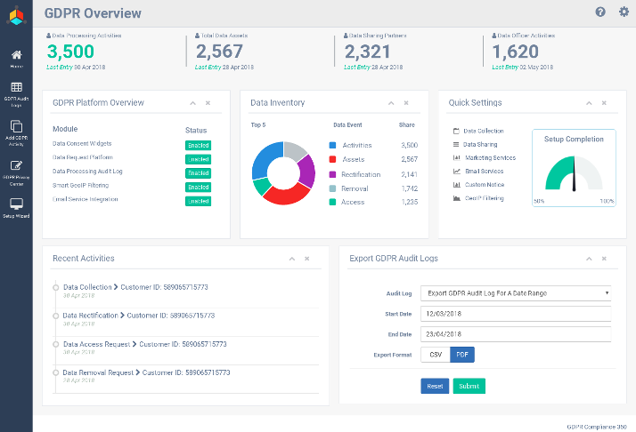
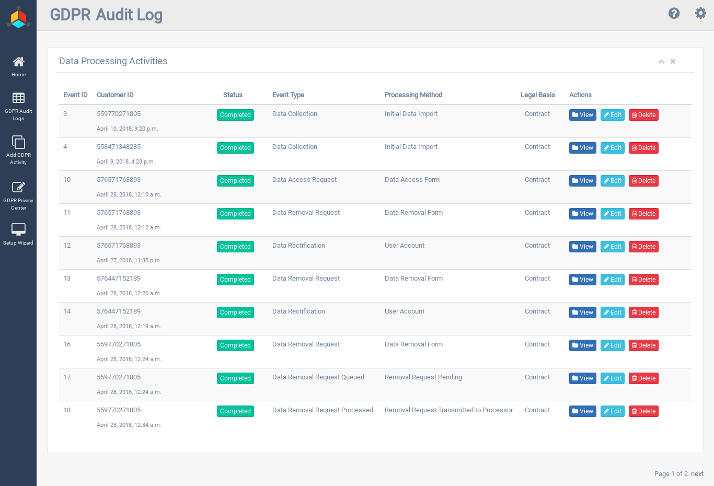
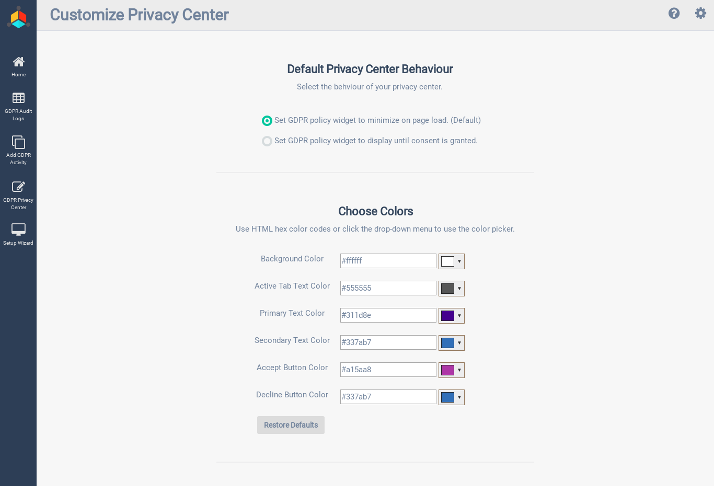
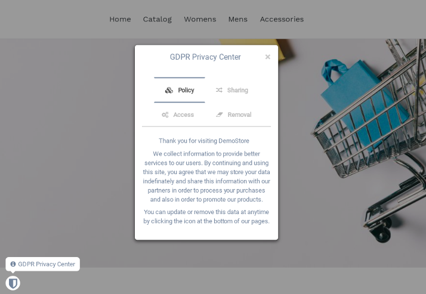

# GDPR 360 - Shopify App for GDPR Complaince 



##### GDPR 360 is an all-in-one Shopify app designed to assist merchants in taking the necessary steps to comply with the new European data protection regulations.

##### How it works:

1. **Data Consent and Requests**  
The app creates data policy notices, consent widgets, and a data request platform that integrate seemlessly with your Shopify store.

2. **Data Processing**  
As customer data is collected, the app automatically processes data events, data inquiries and data removal requests in real-time.

3. **Audit Logs**  
All data processing activities are subsequently logged in the stores data registry. A streamlined audit log is rendered and ready to be exported.

##### Features:
 
-Creates front-end data policy notices and consent widgets.
 
-Provides a front-end customer data request platform.
 
-Automatically processes data requests (access and removal).
 
-Generates audit logs of your shop's data processing activities.
 
-Smart geoIP filtering, GDPR widgets are only displayed to EU visitors.
 
-Synchronizes data removal operations across your shopify store and your mailing lists with email service provider integration for MailChimp.
 
-Multilinugual front-end GDPR data policy notices: English, French, German, Spanish, and Italian.
 
-Export GDPR audit logs in multiple formats: csv, excel, pdf.

## Screenshots







## Getting Started

These instructions will get you a copy of the project up and running on your local machine for development and testing purposes. See deployment for notes on how to deploy the project on a live system.

### Prerequisites

* Python 2.7
* Django
* Rabbit-mq
* Supervisor
* MaxMing GeoIP
* For a complete list of required python libraries see [requirement.txt](https://github.com/mkrahal/gdprdynamics/blob/master/extras/requirements.txt)
* App must be hosted on a webserver with a valid SSL certificate (must use https protocol)

### Installing

1. Clone the repository 
	```
	$ git clone https://github.com/mkrahal/gdprdynamics
	```

2. Install rabbitmq and its dependencies
	```
	$ sudo apt-get install -y erlang
	$ sudo apt-get install rabbitmq-server
	```

3. Enable rabbitmq to start on boot
	```
	$ sudo systemctl enable rabbitmq-server
	$ sudo systemctl start rabbitmq-server 
	```

4. Install supervisor to run celery cronjobs as daemons (in background)
	```
	$ sudo apt-get install supervisor
	```

5. Install the libraries listed in requirements.txt using pip
	```
	$ pip install -r gdprdynamics/extras/requirements.txt
	```

6. Register your app in shopify's partner backend, get your API_KEY and SECRET and register you redirect_url (white listed url)

7. Enter your API_KEY, SECRET, and redirect_url in app_settings.py 

8. Make migrations in django to create your tables from your predefined models using:
   	```
	$ python manage.py makemigrations
	$ python manage.py migrate 
	```
9. Start services and run app
	```
	$ sudo supervisorctl restart shopify_scaffolding_beat
	$ sudo supervisorctl restart shopify_scaffolding
	$ sudo systemctl start rabbitmq-server
	$ python manage.py runserver
	```
	
## Deployment

DO NOT USE DJANGO DEVELOPMENT WEB SERVER IN A PRODUCTION SETTING. 
Production server should be run using a webserver / python engine combination (such as APACHE + wsgi).

## Built With

* [Python 2.7](https://www.python.org/)
* [DJANGO 1.11](https://www.djangoproject.com/)
* [SHOPIFY Python API](https://github.com/Shopify/shopify_python_api)

## Contributing

Please read [CONTRIBUTING.md](https://github.com/mkrahal/djapify/blob/master/CONTRIBUTING.md) for details on our code of conduct, and the process for submitting pull requests to us.


## Built With

* Python 2.7

## Authors

* **MK RAHAL** - *Initial work* - [MK RAHAL](https://github.com/mkrahal)

## License

This project is licensed under the MIT License - see the [LICENSE.md](https://github.com/mkrahal/djapify/blob/master/LICENSE.md) file for details

